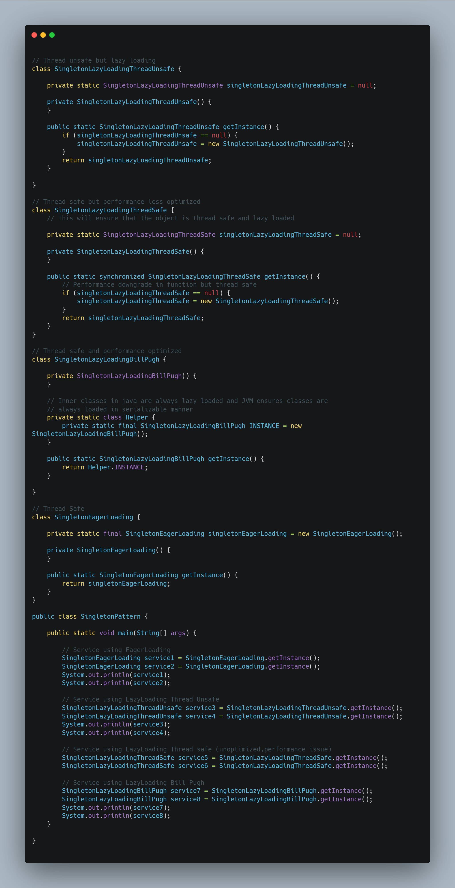

# ☕ Java Singleton Pattern Examples

This repository contains multiple implementations of the **Singleton Design Pattern** in Java, demonstrating different initialization strategies, thread-safety techniques, and performance considerations.

## 📌 Implementations Included

- **Eager Initialization**
- **Lazy Initialization (Thread Unsafe)**
- **Lazy Initialization (Thread Safe with `synchronized`)**
- **Bill Pugh Singleton (Recommended)**

## 🎯 Purpose

To provide clear, commented examples that:

- Explain **thread-safety** in Singleton implementations
- Highlight **performance trade-offs**
- Demonstrate **best practices** for real-world projects

