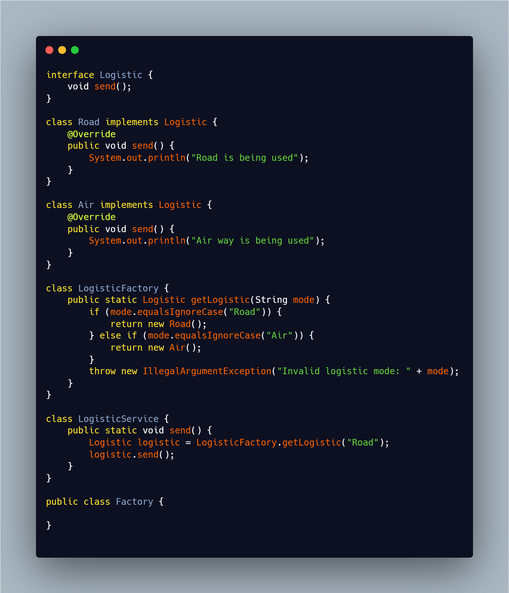

# 🏭 Java Factory Design Pattern Examples

This repository contains multiple examples of the **Factory Design Pattern** in Java, showcasing how to create objects without exposing the creation logic to the client and promoting loose coupling.

